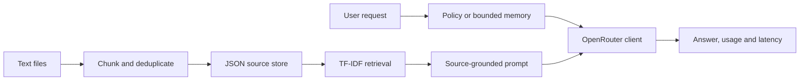

# NLP Assistant Engineering Patterns

Three small AI workflows: a bounded support assistant, recent-turn conversational memory,
and document-grounded Q&A. The original scripts had deprecated imports, machine-specific
environment paths, and exceptions during import. The refactor separates provider I/O from
testable application behavior.

## Architecture



TF-IDF is deliberate: the demo corpus is small, retrieval is fully local and reproducible, and
a paid embedding provider plus Chroma service is unnecessary. This is lexical retrieval, not
semantic embedding search; vocabulary mismatch is a known limitation. Stable chunk IDs make
repeated ingestion idempotent.

## Setup and use

```bash
python -m venv .venv
source .venv/bin/activate  # Windows: .venv\Scripts\activate
pip install httpx scikit-learn pytest ruff
```

Export the variables listed in `.env.example`. No secrets are loaded from a hardcoded path
and no provider is called during import. Select an available model explicitly.

```bash
python Task0.py
python Task1.py
python Task2.py --file notes.txt
python Task2.py --question "What does the document explain?"
pytest -q
ruff check assistants.py Task0.py Task1.py Task2.py tests
ruff format --check assistants.py Task0.py Task1.py Task2.py tests
```

The provider adapter uses the documented [OpenRouter chat-completions API](https://openrouter.ai/docs/api_reference/overview),
a bounded timeout, explicit HTTP failures, response validation, actual returned token usage,
and measured latency. It does not retry paid generation automatically.

## Verification and boundaries

Tests use a fake provider and mock HTTP transport: policy placement, bounded memory, retrieval
ranking, persistence, deduplication, empty retrieval, token parsing, and provider errors.
GitHub Actions runs those tests without credentials or API spending.

Prompt instructions are not a security guarantee. There are no account-changing tools,
persistent personal memory, autonomous agents, public deployment, or answer-correctness
benchmark. No cloud, database server, Docker, or orchestrator is claimed.
